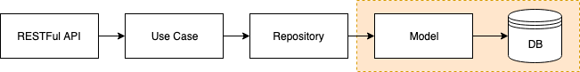

# Cookiecutter for Flask API

## Overview
Reusable template to quickly run your Flask API with or without a Database.
It supports DynamoDB for now.

### Software design



Software design is based on [Clean Architecture from this post](https://www.thedigitalcatonline.com/blog/2016/11/14/clean-architectures-in-python-a-step-by-step-example/). 
Goal of the design is to make use of repositories and models so that it can conveniently switch data sources.

## Supported options
- Flask API only (without repositories and models)
- Flask API with DynamoDB

## Getting Started

1. Install [cookiecutter](https://cookiecutter.readthedocs.io/en/latest/installation.html).
1. Run the following command:
    ```
    cookiecutter git@github.com:ardydedase/cookiecutter-flask-api.git
    ```

1. Follow the instructions in the command line.


## Development

### Run with Docker

Pre-requisites:
- Install Docker

Run the following command:
```
docker-compose up
```

### Run locally
Pre-requisites:
- Download [DynamoDB Local](https://docs.aws.amazon.com/amazondynamodb/latest/developerguide/DynamoDBLocal.html)
- Python 3.6
- Virtual Environment

Steps:

Skip the steps that you don't need.

1. Run the local DynamoDB
    ```
    java -Djava.library.path=./DynamoDBLocal_lib -jar DynamoDBLocal.jar
    ```
1. Setup your virtual environment. [Guide here](https://packaging.python.org/guides/installing-using-pip-and-virtual-environments/).
1. Install the required packages:
    ```
    pip install -r requirements.txt
    ```
1. Populate the DynamoDB table.
    ```
    FLASK_ENV=development FLASK_APP=app/cli.py flask dynamo create-poem-table
    ```
1. Run Flask locally:
    ```
    FLASK_ENV=development FLASK_APP=app/main.py FLASK_DEBUG=1 flask run 
    ```

## Testing locally
Checkout this repo and Run the following:

```
cookiecutter cookiecutter-flask-dynamodb
```
